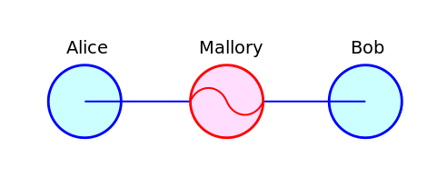

## 如何通过ssh-keygen实现免密码登陆
**转载** **2017年3月3日**
>最近在搭建Hadoop环境的时候遇到了ssh免密码登陆的问题，Hadoop集群中master为了远程执行slaves主机上的脚本以启动对应守护进程，这种情况下就要求主机之间建立互信，做到免密码登陆，省去输入密码的步骤。今天我们来简单介绍一下SSH.

SSH，即Secure Shell，是一种用于远程登陆和远程控制的网络协议。包括SCP也是SSH协议框架中数据传输协议。

之所以叫做Secure Shell,重点便在于安全。Ftp和telnet等协议在网络上用明文传送数据、帐号和口令，可能会遭受Man-in-the-middle attack，SSH中基于口令的安全认证也不排除此风险。
#### 1. Man-in-the-middle attack

密码学中，Man-in-the-middle attack(MITM)，叫做”中间人攻击”,攻击者会中继通信双方的请求并可能恶意篡改传递的消息，而通信双方对此却茫然不知。一个例子便是主动窃听，攻击者会与通信双方建立单独连接，拦截相关消息并植入假冒消息，此时虽然通信两端都认为正在直接与对方通信，但实际上会话已经被攻击者所控制。这种例子在很多场景中都很常见，比如在公共的Wifi区域，攻击者可能会将自己变为一个Man-in-the-middle.

SSH为了保证安全，采用了公钥(Pub-key)加密,流程如下：

1)远程主机(Bob)收到用户(Alice)登陆请求

2)远程主机将自己的Pub_key返回给用户

3)用户使用该Pub_key对密码进行加密并发送给远程主机

4)远程主机认证通过

然而，一旦出现中间人Mallory后，可能会拦截用户请求并将一个伪造的Pub_key发送给用户，这个时候用户是不容易区分这个key的真伪的。用户把加密后的密码发送出去后，密码便遭到窃取。

对于这种情况，我们根据SSH两种登陆验证方式分别分析一下是如何处理的。

#### 2. 基于口令的安全认证

口令登陆是ssh最常见的形式，具体用法是 `ssh {user}@{host}`

如果我现在要从本机登陆另外一台主机10.237.39.108，如果这是第一次登陆，那么会收到如下提示：
<pre>
<code class="language-cmd">
lawrence@lawrence-computer:~$ ssh work@10.237.39.108
The authenticity of host '10.237.39.108 (10.237.39.108)' can't be established.
RSA key fingerprint is 93:11:a3:cf:e6:2a:58:9b:4d:eb:ed:ff:92:7f:80:f9.
Are you sure you want to continue connecting (yes/no)? yes
Warning: Permanently added '10.237.39.108' (RSA) to the list of known hosts.
work@10.237.39.108's password:
</code>
</pre>

询问Are you sure you want to continue connecting?的原因是客户端无从分辨远程主机返回的Pub-key的正确性，即不确定该主机是否我想要连接的目标主机。因此提示了”RSA key fingerprint”，也就是公钥指纹，使用rsa算法生成的Pub-key长度长达1024位，不易识别，因此公钥指纹是其MD5加密后的128位表示，便于用户比较。至于用户如何确认公钥指纹的正确性，只能远程主机提前告知，然后登陆的时候用户自行核准。

用户确认继续连接后，便会提示输入密码，登陆成功。

当远程主机的公钥被接受以后，它就会被保存在文件`~/.ssh/known_hosts`之中。下次再连接这台主机，系统就会认出它的公钥已经保存在本地了，从而跳过警告部分，直接提示输入密码。

口令登陆不排除Man-in-the-middle attack的情况，用户发起登陆请求的时候返回的Pub-key有可能是来自“中间人”。

### 3. 基于密钥的安全认证(免密码登陆)

基于密钥的安全认证需要用户机生成一对密钥(公钥和私钥)，并把公共密钥放在远程主机上。

1)客户端对远程主机发起登陆
2)远程主机向用户发送随机字符串
3)用户用私钥加密字符串后发送给远程主机
4)远程主机使用之前存储的公钥解密，如果字符串一致则允许登陆。

这种认证方式不会产生所谓的中间人，因为中间人不知道私钥。该方法要求用户必须提供自己的公钥。我们看一下配置过程：

>场景1:ssh连接到其他的远程主机,我们以要从hdsuperuser@10.236.121.16连接到lawrence@10.236.127.63为例

**step 1:在用户机10.236.121.16上生成公钥私钥**
<pre>
<code class="language-cmd">
     ssh-keygen -t rsa -P '' -f ~/.ssh/id_rsa
</code>
</pre>
**step 2:把public key 上传到要连接的远程主机,此处需要输入密码。**
<pre>
<code class="language-cmd">
 cat .ssh/id_rsa.pub | ssh lawrence@10.236.127.63 'cat >> .ssh/authorized_keys'
</code>
</pre>
**step 3:设置权限,确保lawrence是pub key的所有者。此处需要输入密码。**
<pre>
<code class="language-cmd">
ssh lawrence@10.236.127.63 "chmod 700 .ssh; chmod 640 .ssh/authorized_keys"
</code>
</pre>
**step 4:尝试是否可以免登陆**
<pre>
<code class="language-cmd">
ssh lawrence@10.236.127.63
</code>
</pre>

>场景2:ssh连接到localhost

**step 1:生成公钥私钥**
<pre>
<code class="language-cmd">
ssh-keygen -t rsa -P '' -f ~/.ssh/id_rsa
</code>
</pre>
**step 2:把public key加入到authorized_keys中, 此处需要输入密码。**
<pre>
<code class="language-cmd">
   cat ~/.ssh/id_rsa.pub >> ~/.ssh/authorized_keys
</code>
</pre>
**step 3:尝试是否可以免登陆**
<pre>
<code class="language-cmd">
ssh localhost
</code>
</pre>  
    
*原文见[如何通过ssh-keygen实现免密码登陆]("http://mthinking.net/blog/tecnology/dailylearning/f7a27ea4-75b9-4f96-9245-abd496617182")*