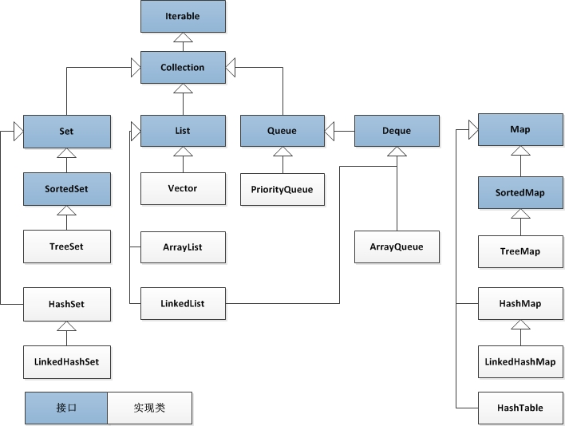
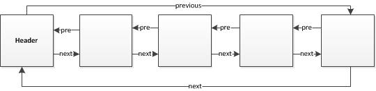
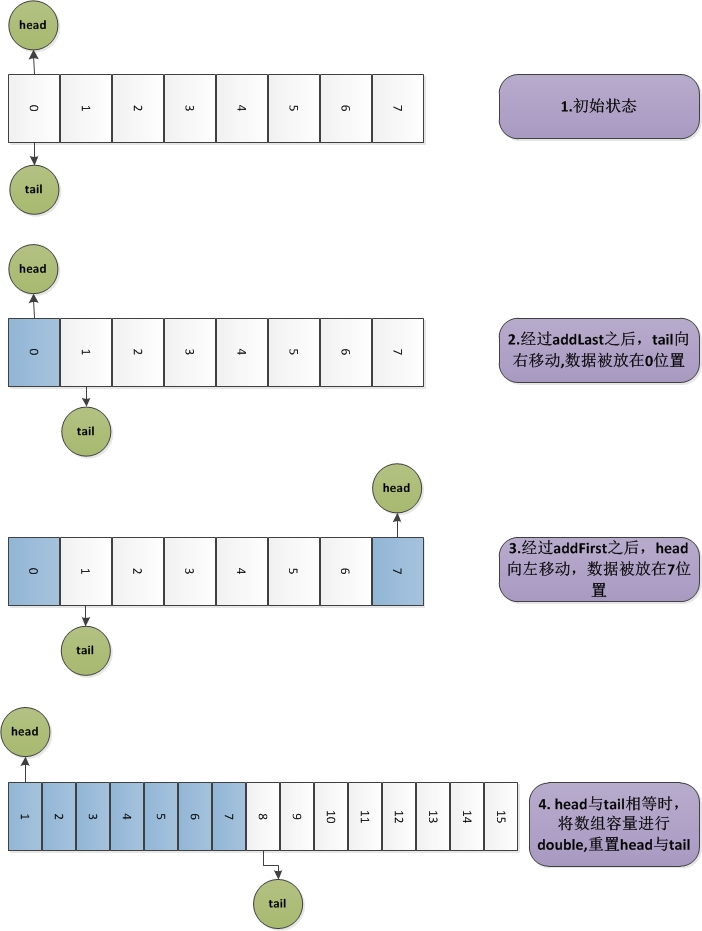

## Java Collections Framework梳理
**转载** **2017年3月5日**
>集合框架是Java提供的非常常用而且实用的类库，集合也是Java程序员面试中经常被问到的知识点，深入理解集合框架对于一个Java程序员来说是非常必要的。

最近把Java Collections Framework进行了简单梳理一下，Java集合框架包括三部分：

- **Interfaces**

    集合的抽象数据类型，有了接口后允许集合可以不关心具体实现进行操作。
- **Implementations**

    集合接口的具体实现，一系列可以重用的数据结构
    
- **Algorithms**

    用于查找、排序等的一系列方法。这些方法都是多态的(polymorphic),适用于多种不同集合类型。

**使用Java Collections Framework的好处：**

- 减少了编程工作量.
- 加快了程序运行速度，提高了编码质量。
- 降低了代码维护难度，提高了可用性。

我们看下Java Collections Framework的类图： 

#### 1.List:有序集合，允许重复元素，允许Null

- **Vector**
    
    使用数组array存放数据，线程安全.
    
- **ArrayList**

    使用数组array存放数据，非线程安全.
    
- **LinkedList**
    
    使用链表存放数据，链表中每个元素Entry都包含具体的Element和对上一个下一个Entry的引用. 值得注意的是，LinkedList不仅实现了List接口，同时也实现了Deque接口，即可以作为队列或双端队列使用.

#### 2.Queue:队列，一般都是FIFO(first-in, first-out)

- **PriorityQueue**

    优先级队列，其本质是一个最小堆，因此可以使用数组array存放数据，最小堆的性质是非叶子节点比其children的值都要小，因此数字最小的元素放在队首.构建了一个balanced binary heap. 元素的优先级通过Comparator或Comparable确定. 入队和出队复杂度均为O(log(n))。
    Deque:双端队列.在Deque中，元素可以在两端进行插入，读取和删除.因此，Deque可以用做FIFO(first-in, first-out),也可以用作LIFO(last-in, first-out)

- **ArrayDeque**

    使用数组存放元素，通过head和tail两个数值标识双边队列元素在数组中的起始位置和结束位置.数组大小始终是2的指数. 一旦数组满(head==tail),对数组进行扩容一倍,将数据从原来数组复制到新的数组.
    
    *head*:数组中元素存放的起始位置
    
    *tail*:addLast时下一个要存放元素的位置
    

- **LinkedList**

使用链表存放元素，之所以能够作为双端队列，是因为使用的链表是循环链表.

#### 3.Map:保存key和value的映射，key不得重复

- **SortedMap**

    保证Map中的key有序，key的顺序通过指定Comparator或Comparable来决定.
- **TreeMap**
 
    基于Red-Black Tree来实现元素存储，根据创建时指定的Comparable或者Comparator在插入或删除元素时对key进行排序. 大部分操作在log(n)时间内完成.
 
- **HashMap**
    
    使用散列表(实际上是数组+链表)来存储数据，使用数组是为了能够通过hashCode()之后随机访问，使用链表是为了解决冲突. 不保证遍历顺序与插入顺序一致.
    
- **LinkedHashMap**

    比HashMap多了一个额外链表来保存所有元素，遍历时和插入的顺序一致. 由于遍历不受数组长度影响，因此遍历速度比HashMap要更快.

- **HashTable**

    同HashMap功能基本一致，不过是线程安全的. key不允许为Null. 不再推荐使用，可以使用ConcurrentHashMap

#### 4.Set:集合，不允许重复元素.

- **SortedSet**
  
    保证Set中的元素有序，元素的顺序通过指定Comparator或Comparable来决定.
  
- **TreeSet**
 
    基于TreeMap实现
 
- **HashSet**
 
    基于HashMap实现
- **LinkedHashSet**
  
    基于LinkedHashMap实现

备注：
本文转载自<a href="http://mthinking.net/">清欢de个人博客</a>.
