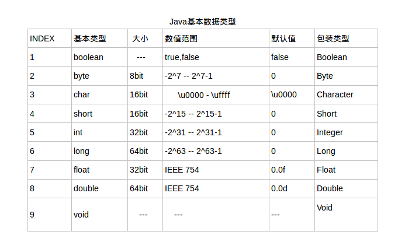

## 详解Java中自动拆箱装箱
**原创** **2017年3月7日**
>自从Java中有了自动拆箱装箱，我们似乎什么都不管了，基本类型和包裹类直接混用貌似也没有什么问题，那么，这到底是为什么呢？

### 概念

#### Java数据类型
在Java中，数据类型可以分为两大种，Primitive Type（基本类型）和Reference Type（引用类型）。基本类型的数值不是对象，不能调用对象的`toString()`、`hashCode()`、`getClass()`、`equals()`等方法。所以Java提供了针对每种基本类型的包装类型。如下：

#### 自动拆箱与自动装箱

Java 1.5中引入了自动装箱和拆箱机制：

**自动装箱**

把基本类型用它们对应的引用类型包装起来，使它们具有对象的特质，可以调用`toString()`、`hashCode()`、`getClass()`、`equals()`等方法。

<pre>
<code class="language-java">
Integer i = 10;
</code>
</pre>

我们反编译可以看到代码是这样的：
<pre>
<code class="language-java">
Integer i = Integer.valueOf(10);
</code>
</pre>

*其实编译器调用的是`static Integer valueOf(int i)`这个方法,`valueOf(int i)`返回一个表示指定int值的Integer对象.*

**自动拆箱**

跟自动装箱的方向相反，将Integer及Double这样的引用类型的对象重新简化为基本类型的数据。

<pre>
<code class="language-java">
int i = new Integer(10);
</code>
</pre>

我们反编译一下代码看到是这样的：
<pre>
<code class="language-java">
int i = new Integer(10).intValue();
</code>
</pre>

* 编译器内部会调用`int intValue()`返回该Integer对象的int值*。

**注意：自动装箱和拆箱是由编译器来完成的，编译器会在编译期根据语法决定是否进行装箱和拆箱动作。**

#### 什么时候自动拆箱装箱

【代码】
<pre>
<code class="language-java">
        // 赋值的时候
        Integer it = 10; // 自动装箱
        int i = it;        // 自动拆箱，实际执行了int i = it.intValue()

        // 运算时候自动拆箱
        Integer a = 10;
        System.out.println(a + a);
</code>
</pre>

上面代码反编译一下：
<pre>
<code class="language-java">
    Integer it = Integer.valueOf(10);
    int i = it.intValue();
    

    Integer a = Integer.valueOf(10);
    System.out.println(a.intValue() + a.intValue());
</code>
</pre>

【思考】
<pre>
<code class="language-java">
    Integer i1 = Integer.valueOf(300);
    Integer i2 = Integer.valueOf(300);
    System.out.println("i1 == i2 :" + (i1 == i2));
    
    Integer i3 = Integer.valueOf(100);
    Integer i4 = Integer.valueOf(100);
    
    System.out.println("i3 == i4 :" + (i3 == i4));
    
    int i5 = 100;
    int i6 = 300;
    
    System.out.println(i1.equals(i2));
    System.out.println(i3.equals(i4));
    System.out.println(i3.equals(Integer.valueOf(i5)));
    System.out.println(i1.equals(Integer.valueOf(i6)));
</code>
</pre>

如上代码运行之后输出是怎样的呢？
<pre>
<code class="language-cmd">
i1 == i2 :false
i3 == i4 :true
true
true
true
true
</code>
</pre>

为了更清晰看到原理，我们还是反编译一下：
<pre>
<code class="language-java">
    Integer i1 = Integer.valueOf(300);
    Integer i2 = Integer.valueOf(300);
    System.out.println("i1 == i2 :" + (i1 == i2));
    
    Integer i3 = Integer.valueOf(100);
    Integer i4 = Integer.valueOf(100);
    
    System.out.println("i3 == i4 :" + (i3 == i4));
    
    int i5 = 100;
    int i6 = 300;
    
    System.out.println(i1.equals(i2));
    System.out.println(i3.equals(i4));
    System.out.println(i3.equals(Integer.valueOf(i5)));
    System.out.println(i1.equals(Integer.valueOf(i6)));
</code>
</pre>

通过运行结果和反编译的代码，我们可以得出以下两个结论：

- `==`号比较的是两个对象的内存地址。如果是基本数据类型，比较的是值大小；如果是包裹类，比较的对象引用。但是需要注意的是：示例代码中`i3==i4`结果却是`true`，这是因为对于–128到127（默认是127）之间的值，`Integer.valueOf(int i) `返回的是缓存的Integer对象（并不是新建对象）。
- `equal()`方法比较两个对象的值（内容）是否相等。
- `equal()`方法是对象才有的方法，所以比较的类型也会被自动装箱。

【思考题】
<pre>
<code class="language-java">
        Integer a = 20;
        Integer b = 130;
        int c = 20;
        int d = 130;

        Integer[] arr = {20,130};

        for (Integer i : arr){
            if (i == a){
                System.out.println("a在数组arr中");
            }

            if(i == b){
                System.out.println("b在数组arr中");
            }

            if( i == c){
                System.out.println("c在数组arr中");
            }

            if (i == d){
                System.out.println("d在数组arr中");
            }
        }
</code>
</pre>

说说上面代码，那几句话会被输出？
