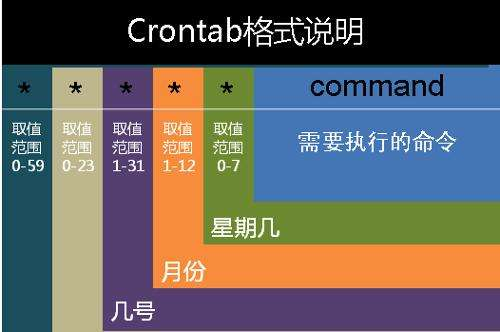

## 说说cron表达式
**原创** **2017年3月9日**
>我们遇到cron表达式主要是linux系统下的crontab定时任务、以及Quartz框架的定时任务配置。本文好好说道说道cron表达式的配置。

如果你使用的是linux系统，可以使用`cat /etc/crontab`查看一下：

<pre>
<code class="language-cmd">
# /etc/crontab: system-wide crontab
# Unlike any other crontab you don't have to run the `crontab'
# command to install the new version when you edit this file
# and files in /etc/cron.d. These files also have username fields,
# that none of the other crontabs do.

SHELL=/bin/sh
PATH=/usr/local/sbin:/usr/local/bin:/sbin:/bin:/usr/sbin:/usr/bin

# m h dom mon dow user	command
17 *	* * *	root    cd / && run-parts --report /etc/cron.hourly
25 6	* * *	root	test -x /usr/sbin/anacron || ( cd / && run-parts --report /etc/cron.daily )
47 6	* * 7	root	test -x /usr/sbin/anacron || ( cd / && run-parts --report /etc/cron.weekly )
52 6	1 * *	root	test -x /usr/sbin/anacron || ( cd / && run-parts --report /etc/cron.monthly )
</code>
</pre>

我们看到的是一张linux系统下的定时任务表。在操作命令前面就配置好了时间表达式，告诉系统在什么时候执行命令。

cron就是一种时间表达式，告诉系统在什么时候执行定时任务，具体格式如下：

<pre>
<code class="language-cmd">
秒 分 小时 日期 月份 星期 年
</code>
</pre>

其中年是可选的，也就是说常见的配置会有6个配置字段。

#### 字段说明

- 秒  0~59，-*/
- 分  0~59，-*/
- 小时 0~23，-*/
- 日期 1~31，-*?/L W C
- 月份 1~12，JAN～DEC，-*/
- 星期 1~7，SUN-SAT , - * ? / L C # 
- 年（可选） 留空, 1970-2099 , - * / 

上述数字都很好理解，特殊符号意义：

- *号表示所有值，意思就是任何时候都匹配。
- ？表示未说明的值，即不关心它为何值。
- -表示一个指定的范围。
- ,表示附加一个可能值，多个值
- /前表示开始时间，符号后表示每次递增的值
- L("last") ("last") "L" 用在day-of-month字段意思是 "这个月最后一天"；用在 day-of-week字段, 它简单意思是 "7" or "SAT"。 如果在day-of-week字段里和数字联合使用，它的意思就是 "这个月的最后一个星期几" – 例如： "6L" means "这个月的最后一个星期五". 当我们用“L”时，不指明一个列表值或者范围是很重要的，不然的话，我们会得到一些意想不到的结果。
- W("weekday") 只能用在day-of-month字段。用来描叙最接近指定天的工作日（周一到周五）。例如：在day-of-month字段用“15W”指“最接近这个 月第15天的工作日”，即如果这个月第15天是周六，那么触发器将会在这个月第14天即周五触发；如果这个月第15天是周日，那么触发器将会在这个月第 16天即周一触发；如果这个月第15天是周二，那么就在触发器这天触发。注意一点：这个用法只会在当前月计算值，不会越过当前月。“W”字符仅能在 day-of-month指明一天，不能是一个范围或列表。也可以用“LW”来指定这个月的最后一个工作日。
- #只能用在day-of-week字段。用来指定这个月的第几个周几。例：在day-of-week字段用"6#3"指这个月第3个周五（6指周五，3指第3个）。如果指定的日期不存在，触发器就不会触发。
- C 指和calendar联系后计算过的值。例：在day-of-month 字段用“5C”指在这个月第5天或之后包括calendar的第一天；在day-of-week字段用“1C”指在这周日或之后包括calendar的第一天。 

#### 【示例】

<pre>
<code class="language-cmd">
0 0 12 * * ?                每天中午12点触发
0 15 10 ? * *               每天上午10:15触发
0 15 10 * * ?               每天上午10:15触发
0 15 10 * * ?               每天上午10:15触发
0 15 10 * * ? *             每天上午10:15触发
0 15 10 * * ?               2005 2005年的每天上午10:15触发
0 * 14 * * ?                在每天下午2点到下午2:59期间的每1分钟触发
0 0/5 14 * * ?              在每天下午2点到下午2:55期间的每5分钟触发
0 0/5 14,18 * * ?           在每天下午2点到2:55期间和下午6点到6:55期间的每5分钟触发
0 0-5 14 * * ?              在每天下午2点到下午2:05期间的每1分钟触发
0 10,44 14 ? 3              WED 每年三月的星期三的下午2:10和2:44触发
0 15 10 ? * MON-FRI         周一至周五的上午10:15触发
0 15 10 15 * ?              每月15日上午10:15触发
0 15 10 L * ?               每月最后一日的上午10:15触发
0 15 10 ? * 6L              每月的最后一个星期五上午10:15触发
0 15 10 ? * 6L              2002-2005 2002年至2005年的每月的最后一个星期五上午10:15触发
0 15 10 ? * 6#3             每月的第三个星期五上午10:15触发 
*/5 * * * * ?               每隔5秒执行一次
0 0 1 ? * L                 每周星期天凌晨1点实行一次
0 0 0,13,18,21 * * ?        每天的0点、13点、18点、21点都执行一次
</code>
</pre>  