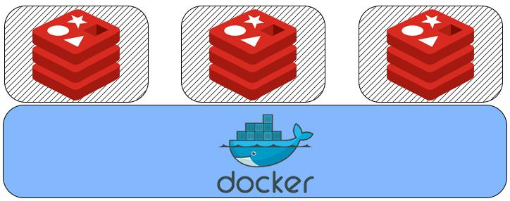

## 使用docker玩玩redis
**原创** **2017年5月2日**
> Docker技术前几年异常火爆，到现在，Docker技术已经广泛使用了，个人开发的时候可能涉及比较少，但是作为开发、测试和运维都得会，所以还是个人开发的角度来玩玩docker。

Docker的好我就不赘述了，想想，你可以使用docker在个人电脑上起多个docker容器，redis、mysql、resin等等服务都可以以docker容器的形式跑在机器上，比本地安装过多的服务强很多。

本文主要列举一下如何安装和启动redis服务。

### 环境
- unbuntu系统
- 已经安装docker
- 已经安装redis客户端

### 检索和安装redis镜像

<pre>
<code class="language-cmd">
# 通过这条命令可以查看docker版本，也为了验证一下docker是否成功安装
sudo docker version

# 通过这条命令可以搜索redis镜像
sudo docker search redis

# 搜索到redis镜像后通过docker pull命令拉取下来，后面参数为镜像名称
sudo docker pull redis

# 查看当前有的镜像
sudo docker images
</code>
</pre>

### 启动redis容器
<pre>
<code class="language-cmd">

# 启动redis镜像
sudo docker run -p 6379:6379 -v $PWD/data:/data -d redis redis-server --appendonly yes
# -p 6379:6379 ： 将容器的６３７９端口映射到主机的６３７９端口
# -v $PWD/data:/data : 将主机下当前目录的data目挂载到容器的/data
# redis-server --appendonly yes :  在容器执行redis-server启动命令，并且打开ｒｅｄｉｓ持久化配置

# 查看容器启动情况
sudo docker ps

CONTAINER ID        IMAGE               COMMAND                CREATED             STATUS              PORTS                    NAMES
66dea867bfbf        redis:latest        "/entrypoint.sh redi   10 seconds ago      Up 10 seconds       0.0.0.0:6379->63

</code>
</pre>

### 连接ｒｅｄｉｓ服务

<pre>
<code class="language-cmd">

# 如果容器已经启动了，我们可以通过本机进行连接了
redis-cli

127.0.0.1:6379>

# 下面命令是杀死正在运行的ＩＤ为66dea867bfbf的容器
sudo docker kill 66dea867bfbf

</code>
</pre>
    
